<div align="center">
  <h1>Mesos - Software Engineering 2025/26</h1>
  <h2> Awarded with 30/30 cum laude </h2>
  <br>
</div>

## Team
- [Daniele Amodio](https://github.com/DanieleAmodio04)
- [Giada Ballerini](https://github.com/giadaballerini)
- [Bernardo Bartolomei](https://github.com/BernardoBartolomei)
- [Filippo Bianchi](https://github.com/Filsave)

## Introduction
This project involved the development of a digital version of the board game [**Mesos**](https://www.craniocreations.it/prodotto/mesos) with a distributed system that allows more computers to connect through a local network using socket and RMI. The rules of the game are explained [here](https://www.craniocreations.it/storage/media/product_downloads/144/1859/Mesos_ITA_Rules_compressed.pdf).

## Requirements
- **JDK 25** or later
- **Maven** 3.8+ (to build from source)
- **PostgreSQL** 13+ (only required server-side, for the leaderboard advanced feature)

## Implemented Functionalities

This implementation follows the **Complete Rules (not implementing the expert variant of the game)** of Mesos (all character types, all events, matches with the full player range, not limited to the simplified 2-player ruleset).

| Feature           | Status |
|--------------------|:------:|
| Basic Rules        | ✅ |
| Complete rules    | ✅ |
| TUI                | ✅ |
| GUI                | ✅ |
| RMI                | ✅ |
| Socket             | ✅ |
| Leaderboard DB     | ✅ |
| Multiple matches   | ✅ |
| Persistence        | ✅ |
| Resilience         | ❌ |

## Architecture

The system follows a client-server architecture with two interchangeable network transports (RMI and Socket) behind a common `Client`/`ClientHandler` abstraction, and an MVC-style separation between the game model, the network/controller layer, and the two UIs (TUI and GUI).

Key design patterns used:
- **MVC**: the model (`GameManager`, `Player`, `Lobby`, etc.) is decoupled from the TUI/GUI views, which only observe and react to model updates.
- **Template Method**: the abstract `Client` class centralizes shared validation logic (phase, turn, board state, resource checks), with `ClientRmi`/`ClientSocket` implementing only the transport-specific hooks (`doLogin`, `doCreateGame`, etc.). The same pattern is used server-side between `GameManager` and `RestoredGameManager`, and again in the abstract `ClientHandler` class, which centralizes shared connection state and the `sendAsync`/`tryMarkDisconnected` logic while leaving `startHealthCheck()` and `handleTransportError(Exception)` as hooks for `ClientHandlerRmi`/`ClientHandlerSocket` to implement.
- **Observer / Visitor**: server-to-client broadcasts go through the `ModelObserver`/`GameNotifier` interfaces (implemented by `ClientHandlerRmi`/`ClientHandlerSocket`), while incoming messages are dispatched via `ClientMessageVisitorImpl`/`ServerMessageVisitorImpl`. The `GameMessageVisitor` interface covers the three in-game action messages (move, draw, skip). The Visitor pattern also drives card behavior in the model (`CardVisitor`, `CanDrawVisitor`, `DrawCardVisitor`, `DrawCountVisitor`, `PlayEventVisitor`, `VillageVisitor`), letting each character/card type define its own behavior without `instanceof` chains.
- **State**: `GamePhaseState` defines the game's phase state machine (`SetupPhaseState`, `DrawPhaseState`, `OptionalDrawPhaseState`, `PlayEventPhaseState`, `EndTurnPhaseState`, `EndRoundPhaseState`, `EndGamePhaseState`), each implementing `nextPhase(GameManager)` and an optional `onEntry` hook.
- **Strategy**: two separate families of interchangeable algorithms in the model: card effects (`CardEffectInstant`/`CardEffectInteractive`, e.g. `GainFood`, `GainPP`, `GainStars`, `ProtectPP`, `DiscountFood`, `LossIfBroke`, `DrawCard`), applied uniformly via `apply(Player, Card)` regardless of which concrete effect a card carries; and event resolution (`Event`, e.g. `Feast`, `Hunt`, `Ritual`, `StonePainting`), each implementing its own `execEvent(List, GamePhaseEnum)`. A finer-grained variant of the same pattern appears one level down: interfaces like `GainPPModifier`, `DiscountFoodModifier`, `GainFoodModifier`, `GainStarsModifier`, `ProtectPPModifier`, and `LossIfBrokeModifier` are each implemented by a corresponding enum (`GainPPEnum`, `DiscountFoodEnum`, etc.), so every enum constant supplies its own concrete strategy without a separate class per variant.
- **Command**: the TUI dispatches user input through the `Command` interface (`MoveCommand`, `DrawCardCommand`, `JoinGameCommand`, `QuitCommand`, etc.), each encapsulating one user-triggered action and its `execute(Client)` logic.
- **Singleton**: GUI asset loaders (`CardImagesLoader`, `TileImagesLoader`, `PawnImagesLoader`, etc.) use a lazily-initialized `getInstance()` with a private constructor, to avoid reloading the same images multiple times.
- **Memento**: `GameManager` implements `Snapshotable.toSnapshot(matchId)`, producing an immutable `GameSnapshot` that captures the full game state. `PersistenceManager`/`GameStateDAO` store and reload these snapshots without depending on `GameManager`'s internals, enabling save-to-disk and crash recovery.
- **DTO (Data Transfer Object)**: model objects are never sent over the wire directly; dedicated DTOs (`BoardDTO`, `PlayerDTO`, `CardDTO`, `TileDTO`, `LobbyDTO`, `PhaseDTO`, etc.) decouple the network protocol from internal model representations.

The full set of sequence diagrams documenting the complete message flow is available at [`deliveries/docs/diagrams/sequence/Network_protocols_and_diagrams.pdf`](deliveries/docs/diagrams/sequence/Network_protocols_and_diagrams.pdf), covering:

1. Login (Socket and RMI)
2. Healthcheck / ping
3. Lobby creation and join
4. Game start and game end
5. Available in-game actions (move, draw, skip, requestRanking)
6. Quit and application exit
7. Transport error handling
8. Client disconnection and server crash detection
9. Reconnection after a server crash

See the [Documentation](#documentation) section below for the full list of project deliverables, including the communication protocol document.

## Screenshots

### GUI

**Main menu**
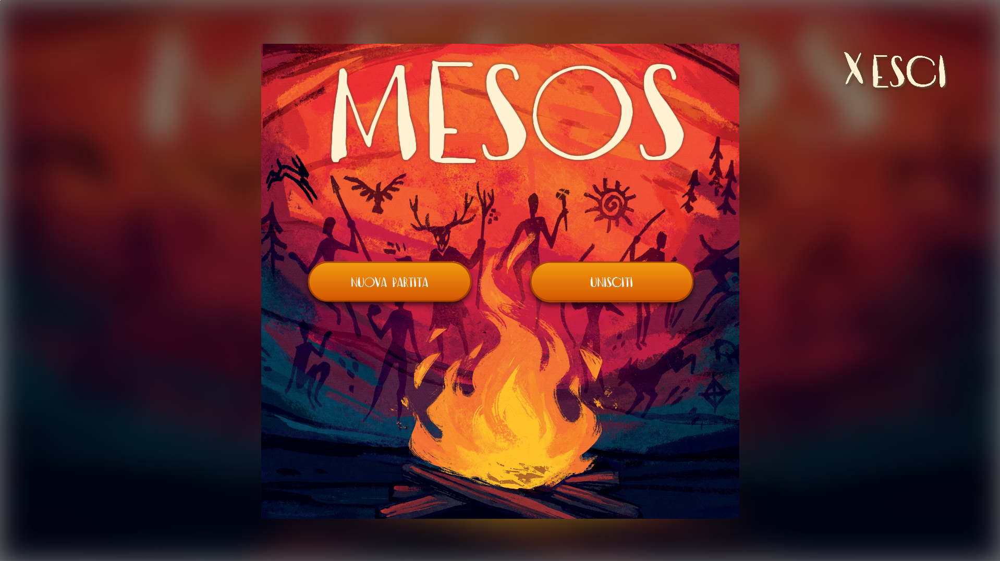

**Game board**
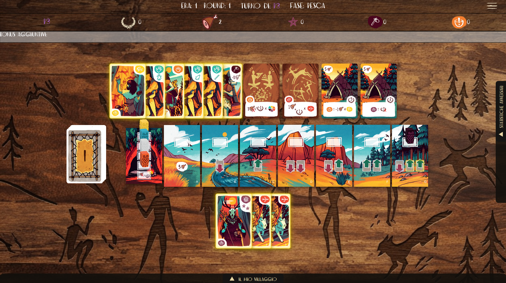

**Village**
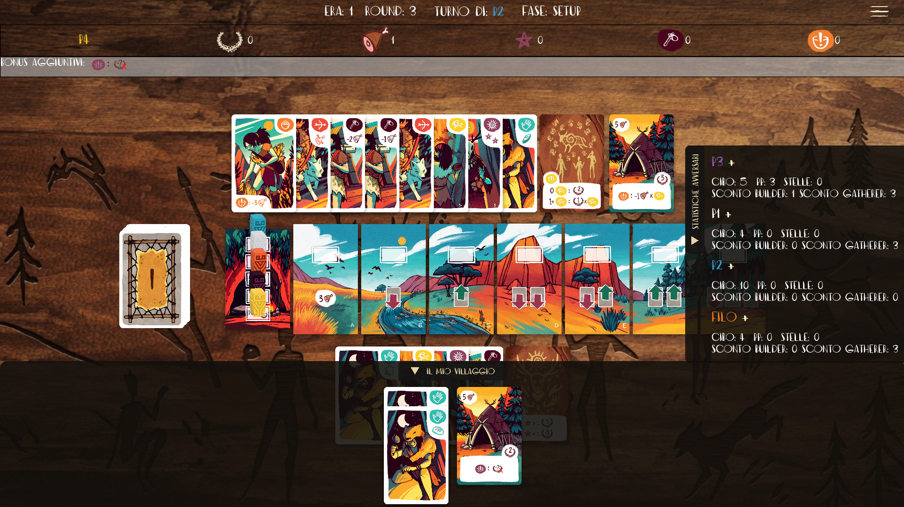

**Opponent's village**
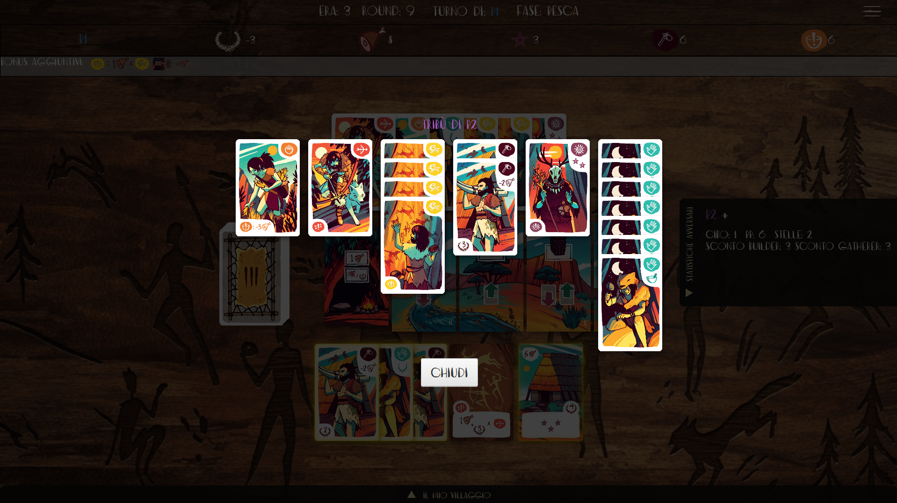

**Card tooltip**
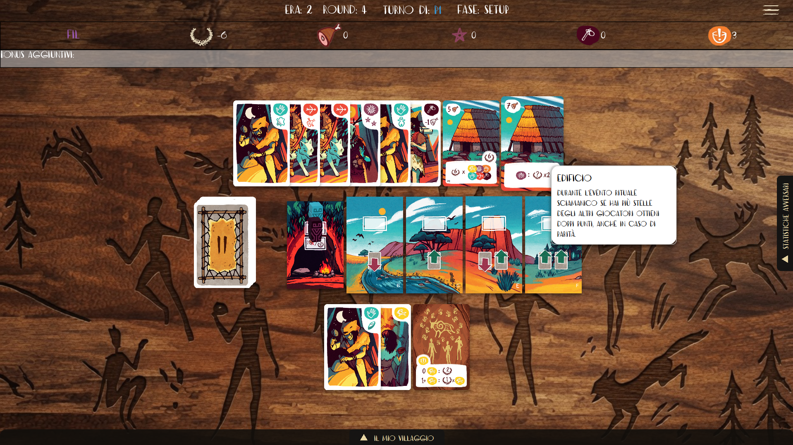

**Round events**
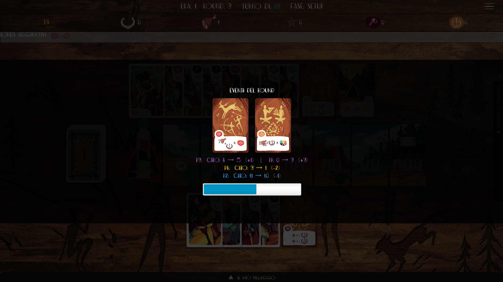

**In-game menu**
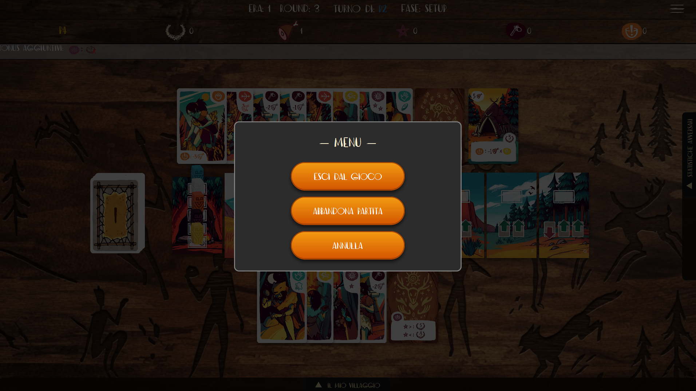

**New era**
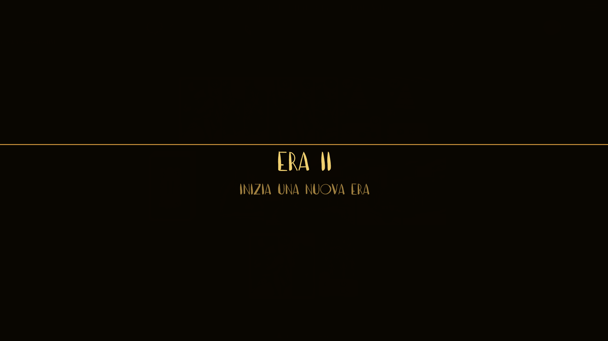

**End-of-game leaderboard**
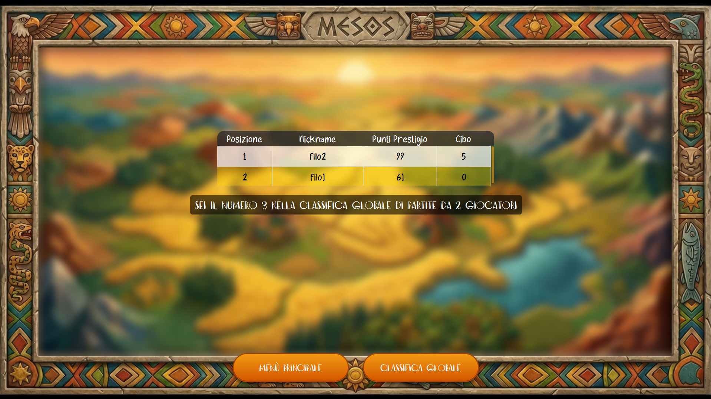

**Global rankings**
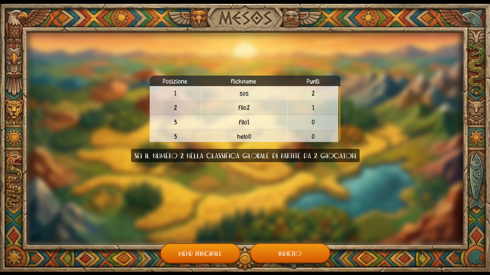

### TUI

**Game board**
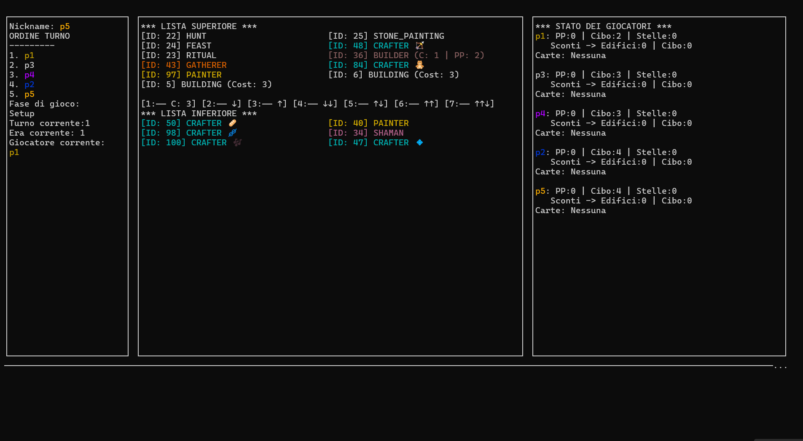

**Round events**
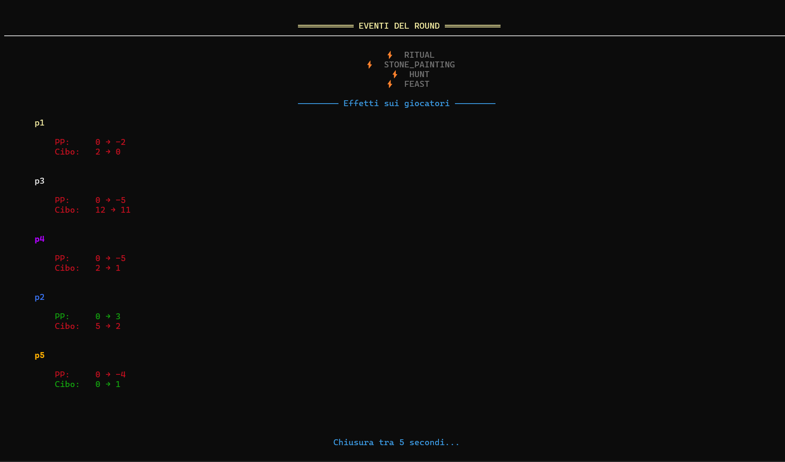

**Player status**
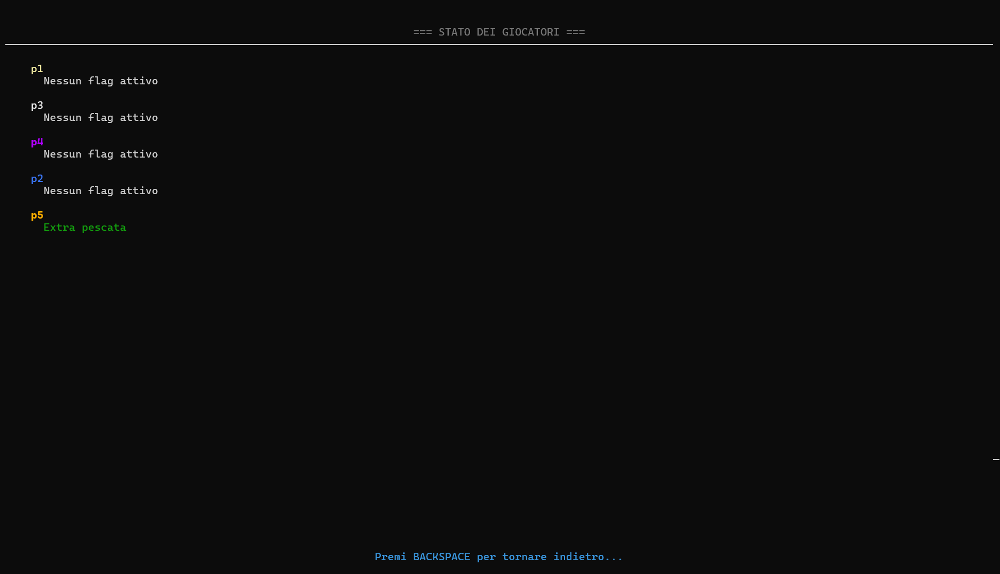

**Available commands**
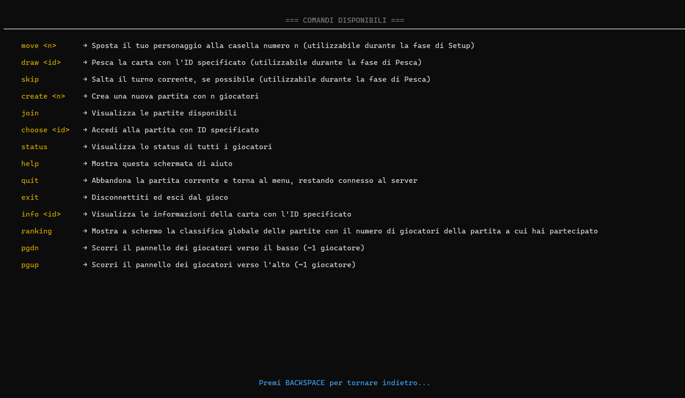

**End-of-game leaderboard**
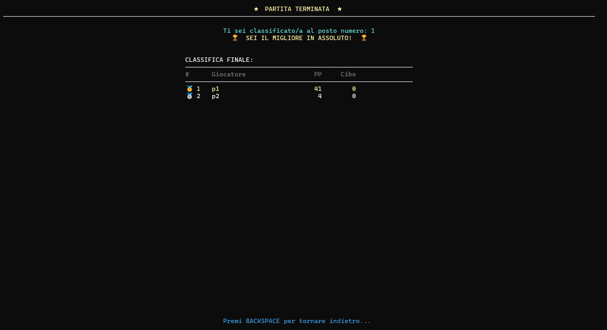

**Global rankings**
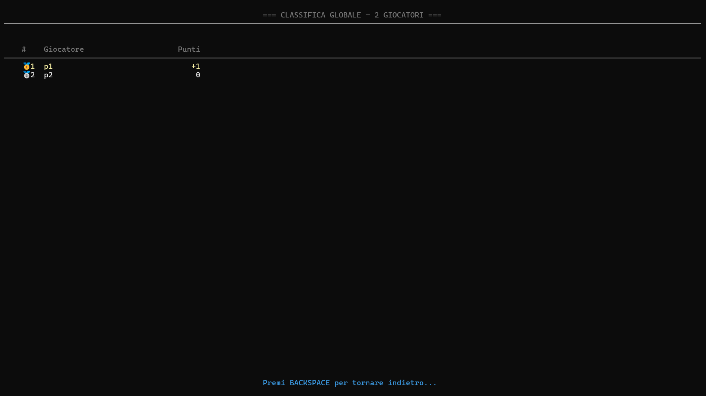

## How to run

### Windows
Double-click `avvia-server.bat` to start the server, and `avvia-client.bat` to start the client.

### macOS / Linux
Run `avvia-server.command` to start the server, and `avvia-client.command` to start the client.

> On macOS, if you get a "permission denied" error, run `chmod +x avvia-*.command` once before double-clicking.

Both scripts launch the corresponding jar from the `deliveries/jars/` folder. The client additionally passes a couple of `--add-opens` flags required by JavaFX:

```bash
# server
java -jar deliveries/jars/server.jar

# client
java --add-opens javafx.graphics/com.sun.javafx.application=ALL-UNNAMED --add-opens java.base/java.lang=ALL-UNNAMED -jar deliveries/jars/client.jar
```

## How to build the jars

From the project root, using the provided Maven profiles:

```bash
# client.jar
mvn clean package -P client

# server.jar
mvn clean package -P server
```

The resulting jars are placed in `deliveries/jars/`.

## Network ports

Both transports use fixed default ports, hardcoded in `ServerMain`:

| Transport | Port | Notes |
|-----------|:----:|-------|
| RMI       | 1099 | RMI registry, service name `GameServer` |
| Socket    | 1234 | Plain TCP |

The server's RMI hostname is auto-detected at startup (via a UDP probe to `8.8.8.8`) and falls back to `localhost` if detection fails. There is currently no command-line flag or config file to override these ports, changing them requires editing `ServerMain` (and the matching client-side constant in `ClientRmi`/`ClientSocket`) and rebuilding.

## Database setup

The leaderboard advanced feature persists match results to PostgreSQL.

### Option A — Docker (recommended)

A `docker-compose.yml` file is provided in `deliveries/db/`. It starts a PostgreSQL 15 container, creates `mesos_db`, and runs `init.sql` automatically:

```bash
docker compose -f deliveries/db/docker-compose.yml up -d
```

The container exposes PostgreSQL on `localhost:5432` with the following credentials, which match the constants hardcoded in `DBManager`:

| Parameter | Value         |
| --------- | ------------- |
| User      | `admin`       |
| Password  | `password123` |
| Database  | `mesos_db`    |

### Option B — Manual setup

1. Create the database:

   ```sql
   CREATE DATABASE mesos_db;
   ```

2. Apply the schema in `deliveries/db/init.sql`, which creates the `matches` table plus two convenience views (`last_id`, `totals`):

   ```bash
   psql -U admin -d mesos_db -f deliveries/db/init.sql
   ```

3. Make sure the PostgreSQL user and password match the constants in `DBManager` (`localhost:5432/mesos_db`, user `admin`, password `password123`).


If the database is unreachable, leaderboard-related calls are caught and logged server-side rather than propagated to clients, so a missing/misconfigured DB does not crash an ongoing match, it simply disables ranking.

## Testing & Coverage
The project includes an extensive JUnit 5 test suite targeting the **model layer**, as per project specifications. 
Code coverage was verified using the built-in IDE coverage runner:

| Layer / Package | Line Coverage | Branch Coverage |
|-----------------|:-------------:|:---------------:|
| `src/main/java/it/polimi/ingsw/model/*` | **98%** | **94%** |

To run the test suite from the command line, navigate to the project root and execute:
```bash
mvn clean test
```

## Javadoc
The codebase is fully documented with English-language Javadoc. 

The pre-generated HTML documentation is available directly in the deliverables folder at:
[`deliveries/docs/javadoc/`](deliveries/docs/javadoc/)

Alternatively, you can rebuild the Javadoc locally at any time with:
```bash
mvn javadoc:javadoc
```

The generated docs are output to `target/site/apidocs/index.html`.

## Documentation

The following table indexes the official academic deliverables and technical documentation produced for this project:

| Document | Status |
|----------|--------|
| UML class diagram (initial) | [`deliveries/docs/diagrams/uml/initial/`](deliveries/docs/diagrams/uml/initial/) |
| UML class diagram (final, tool-generated) | [`deliveries/docs/diagrams/uml/final/`](deliveries/docs/diagrams/uml/final/) |
| Sequence diagrams | PDF: [`deliveries/docs/diagrams/sequence/Network_protocols_and_diagrams.pdf`](deliveries/docs/diagrams/sequence/Network_protocols_and_diagrams.pdf) (sources: [`deliveries/docs/diagrams/sequence/`](deliveries/docs/diagrams/sequence/)) |
| Javadoc | Pre-generated in [`deliveries/docs/javadoc/`](deliveries/docs/javadoc/) (or via `mvn javadoc:javadoc`) |
| Unit tests | Source code in `src/test/java` (run via `mvn test`) |

## Project structure

```
src/main/java/it/polimi/ingsw/
├── client/          # Client-side: TUI, GUI, RMI/Socket transport, command objects
│   ├── command/
│   ├── data/
│   ├── rmi/
│   ├── socket/
│   └── ui/
│       ├── gui/
│       └── tui/
│           ├── screen/
│           └── utility/
├── controller/      # Message routing between network layer and model
├── database/        # PostgreSQL connection and leaderboard DAO
├── enumerations/
├── exceptions/
├── model/           # Game model: entities, players, actions, game manager
│   ├── action/
│   ├── entities/
│   │   ├── card/
│   │   │   ├── effects/
│   │   │   │   ├── instant/
│   │   │   │   └── interactive/
│   │   │   └── types/
│   │   │       ├── building/
│   │   │       ├── character/
│   │   │       └── event/
│   │   └── tile/
│   ├── gamemanager/
│   ├── interfaces/
│   └── player/
├── network/         # DTOs, messages, and client/server transport handlers
│   ├── client/
│   ├── dto/
│   ├── messages/
│   │   ├── client/
│   │   ├── server/
│   │   └── service/
│   └── server/ 
│       ├── rmi/
│       └── socket/
├── observer/        # ModelObserver / GameNotifier interfaces
├── persistency/     # Game state save/restore (disk persistence)
├── server/          # Server entry point and match orchestration (MatchManager)
└── visitors/        # Client/server message visitors
```

## Disclaimer

**Il Gioco da tavolo Mesos e tutto il relativo materiale grafico è di esclusiva proprietà di Cranio Creations.**

*(The board game Mesos and all related graphic material is the exclusive property of Cranio Creations.)*

All copyrighted graphical assets used in this project were provided by Politecnico di Milano in collaboration with the respective rights holders, strictly for educational purposes. Any commercial use, redistribution, or reproduction of this project or its assets is strictly prohibited.